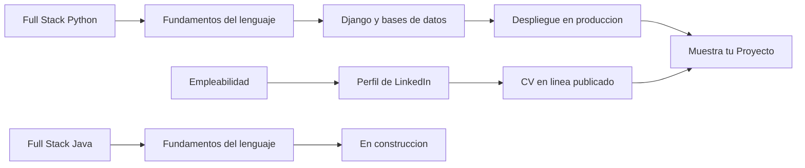

<div align="center">

# Comunidad · felipecuevas.dev

**Espacio de preguntas, proyectos y acompañamiento para quienes aprenden a programar conmigo.**

[](https://github.com/ffelipecuevasc/comunidad/discussions)
[](https://felipecuevas.dev)
[](https://felipecuevas.dev/recursos)

[Hacer una pregunta](https://github.com/ffelipecuevasc/comunidad/discussions/new?category=preguntas-y-respuestas) ·
[Mostrar mi proyecto](https://github.com/ffelipecuevasc/comunidad/discussions/new?category=muestra-tu-proyecto) ·
[Dudas de una ruta](https://github.com/ffelipecuevasc/comunidad/discussions/new?category=dudas-por-ruta)

</div>

---

## Contenidos

- [Qué es este espacio](#qué-es-este-espacio)
- [Cómo empezar](#cómo-empezar)
- [Dónde publicar cada cosa](#dónde-publicar-cada-cosa)
- [Cómo preguntar para que te respondan rápido](#cómo-preguntar-para-que-te-respondan-rápido)
- [Rutas de aprendizaje](#rutas-de-aprendizaje)
- [Normas de convivencia](#normas-de-convivencia)
- [Moderación](#moderación)
- [Preguntas frecuentes](#preguntas-frecuentes)
- [Sobre mí](#sobre-mí)

---

## Qué es este espacio

Este repositorio no contiene código: contiene **conversación**. Es el foro de la comunidad de
estudiantes de [felipecuevas.dev](https://felipecuevas.dev), construido sobre GitHub
Discussions y visible también desde el propio sitio web.

Aquí puedes resolver dudas técnicas, mostrar lo que estás construyendo y acompañar a otras
personas que van un paso más atrás que tú. Está pensado para alumnos de mis bootcamps de
**Talento Digital — SENCE**, de mis asignaturas universitarias y para cualquiera que siga las
rutas de aprendizaje publicadas en el sitio.

> [!NOTE]
> Participar exige una cuenta de GitHub. No es un obstáculo: es parte de la formación.
> El manejo de esta plataforma es exactamente lo que se evalúa en el módulo de
> empleabilidad de la industria digital.

---

## Cómo empezar

- [ ] Crea tu cuenta en [github.com/signup](https://github.com/signup) si aún no la tienes
- [ ] Completa tu perfil con nombre real y fotografía: acá nadie contrata a un avatar vacío
- [ ] Pulsa **Watch → All Activity** en este repositorio para recibir las novedades
- [ ] Lee las [normas de convivencia](#normas-de-convivencia)
- [ ] Preséntate en [Anuncios](https://github.com/ffelipecuevasc/comunidad/discussions/categories/anuncios)

> [!TIP]
> Tu perfil de GitHub es parte de tu currículum. Cada respuesta útil que publiques aquí
> queda registrada en tu actividad pública y la ve cualquier reclutador que te busque.

---

## Dónde publicar cada cosa

| Categoría | Úsala para | Detalle |
|:--|:--|:--|
| [**Preguntas y Respuestas**](https://github.com/ffelipecuevasc/comunidad/discussions/categories/preguntas-y-respuestas) | Dudas técnicas, de clases y de materiales | Permite marcar una respuesta como aceptada |
| [**Dudas por ruta**](https://github.com/ffelipecuevasc/comunidad/discussions/categories/dudas-por-ruta) | Preguntas sobre un paso concreto de una ruta | Es la categoría enlazada desde el sitio web |
| [**Muestra tu Proyecto**](https://github.com/ffelipecuevasc/comunidad/discussions/categories/muestra-tu-proyecto) | Publicar lo que estás construyendo | Comparte el repositorio y el enlace en vivo |
| [**Anuncios**](https://github.com/ffelipecuevasc/comunidad/discussions/categories/anuncios) | Leer novedades y presentarte | Solo yo abro hilos; tú puedes responder |

> [!IMPORTANT]
> Publicar en la categoría correcta no es una formalidad burocrática: es lo que permite
> que quien tenga tu mismo problema dentro de seis meses lo encuentre.

---

## Cómo preguntar para que te respondan rápido

Una pregunta bien planteada suele responderse el mismo día. Una mal planteada puede quedarse
sin respuesta, no por desinterés, sino porque nadie logra entender qué te pasa.

**Estructura recomendada:**

```markdown
### Qué intento hacer
Conectar mi aplicación Django a MySQL en AlwaysData.

### Qué esperaba que ocurriera
Que `python manage.py migrate` creara las tablas.

### Qué ocurrió en realidad
El comando falla con un error de acceso denegado.

### Qué ya intenté
- Verifiqué usuario y contraseña en el panel de AlwaysData
- Revisé que el host no fuera `localhost`
- Reinstalé `mysqlclient`

### Entorno
Python 3.12 · Django 5.0 · Windows 11
```

**Pega el código y el error como texto, nunca como captura de pantalla.** Una captura no se
puede copiar, ni buscar, ni corregir. Usa bloques de código con el lenguaje declarado:

````markdown
```python
def conectar():
    return MySQLdb.connect(host="mysql-usuario.alwaysdata.net")
```
````

Y para errores largos, pliega la salida para no inundar el hilo:

````markdown
<details>
<summary>Traza completa del error</summary>

```
django.db.utils.OperationalError: (1045, "Access denied for user...")
```

</details>
````

> [!WARNING]
> Nunca publiques contraseñas, claves de API, tokens ni cadenas de conexión reales.
> Reemplázalas por `usuario`, `contraseña` o `xxxxx` antes de pegar el código.
> Una clave publicada en GitHub es rastreada por robots en cuestión de minutos.

---

## Rutas de aprendizaje

Las rutas viven en [felipecuevas.dev/recursos](https://felipecuevas.dev/recursos). Cada paso
tiene su material descargable y su progreso se guarda en tu navegador. Las dudas de cada ruta
se resuelven en la categoría **Dudas por ruta**.



| Ruta | Pasos | Estado |
|:--|:-:|:--|
| [Full Stack Python](https://felipecuevas.dev/recursos?ruta=python) | 6 | Completa |
| [Empleabilidad](https://felipecuevas.dev/recursos?ruta=empleabilidad) | 2 | Completa |
| [Full Stack Java](https://felipecuevas.dev/recursos?ruta=java) | 1 | En construcción |

---

## Normas de convivencia

**1. Respeto ante todo.**
No se toleran descalificaciones ni burlas hacia quien pregunta. Aquí nadie nació sabiendo, y
la persona que hoy consulta algo básico mañana estará respondiendo.

**2. Busca antes de preguntar.**
Es probable que tu duda ya esté resuelta. Usa el buscador de Discussions antes de abrir un
hilo nuevo.

**3. Pregunta bien.**
Cuenta qué intentaste, qué esperabas y qué ocurrió. Sigue la
[estructura recomendada](#cómo-preguntar-para-que-te-respondan-rápido).

**4. Usa la categoría correcta.**
Las dudas técnicas van en Preguntas y Respuestas; los proyectos, en Muestra tu Proyecto.

**5. Marca la respuesta que te sirvió.**
Cierra el círculo. Ayuda a quien llegue después con el mismo problema.

**6. Protege tus datos y los de terceros.**
Nada de contraseñas, claves de acceso, datos personales de compañeros ni material con derechos
de autor ajeno.

**7. Sin spam ni promoción.**
No es el lugar para vender servicios, cursos de terceros ni ofertas comerciales.

**8. Contribuye, no solo consumas.**
Si sabes la respuesta, escríbela. Una comunidad donde todos preguntan y nadie responde se
apaga sola.

---

## Moderación

| Aspecto | Definición |
|:--|:--|
| **Quién modera** | Felipe Cuevas. Con el tiempo, alumnos destacados de cada cohorte podrán sumarse como moderadores |
| **Plazo de respuesta** | Hasta **2 días hábiles** en Preguntas y Respuestas |
| **Qué se elimina** | Spam, promoción comercial, faltas de respeto y publicación de datos sensibles |
| **Qué se edita** | Formato de código mal aplicado y títulos poco descriptivos, para que el hilo sea encontrable |
| **Qué no se toca** | Preguntas mal planteadas: se corrigen conversando, no borrando |

> [!NOTE]
> El plazo es un compromiso realista, no un máximo aspiracional. Prefiero cumplir dos días
> siempre que prometer respuesta inmediata y fallar.

---

## Preguntas frecuentes

<details>
<summary><strong>¿Necesito estar inscrito en algún curso para participar?</strong></summary>

<br>

No. La comunidad es abierta. Las rutas de aprendizaje y los materiales del sitio son de acceso
libre, y cualquier persona que los siga puede preguntar aquí.

</details>

<details>
<summary><strong>¿Puedo escribir desde el sitio web en vez de entrar a GitHub?</strong></summary>

<br>

Sí. El foro está integrado en [felipecuevas.dev](https://felipecuevas.dev) mediante
[Giscus](https://giscus.app), un componente de código abierto, sin publicidad y sin rastreo de
terceros. Escribas donde escribas, el mensaje queda guardado en este repositorio.

</details>

<details>
<summary><strong>¿Qué hago si nadie responde mi pregunta?</strong></summary>

<br>

Antes de insistir, revisa si tu pregunta cumple la estructura recomendada. En la mayoría de los
casos el silencio significa que falta información para poder ayudarte. Edita el hilo agregando
el código, el error completo y tu entorno.

</details>

<details>
<summary><strong>¿Puedo responder aunque recién esté aprendiendo?</strong></summary>

<br>

Por favor, hazlo. Explicar algo es la forma más rápida de consolidarlo, y quien va un paso más
atrás que tú entiende mejor tu explicación que la mía. Si te equivocas, alguien lo corregirá
sin drama.

</details>

<details>
<summary><strong>¿Esto reemplaza a las clases?</strong></summary>

<br>

No. Es un complemento asincrónico. Las dudas urgentes de una clase en curso se resuelven en la
clase; aquí quedan registradas las que sirven a todos y las que aparecen fuera de horario.

</details>

---

## Sobre mí

**Francisco Felipe Cuevas Cerón** — Ingeniero Informático.
Instructor senior en bootcamps de Talento Digital — SENCE y Alura Latam. Docente universitario
en INACAP, Duoc UC e IPLACEX. Certificado por Oracle, Amazon Web Services y Python Institute.

[](https://felipecuevas.dev)
[](https://www.linkedin.com/in/ffelipecuevasc/)
[](https://github.com/ffelipecuevasc)

---

<div align="center">
<sub>Si esta comunidad te sirvió, la mejor forma de agradecer es responder la pregunta de otra persona.</sub>
</div>
